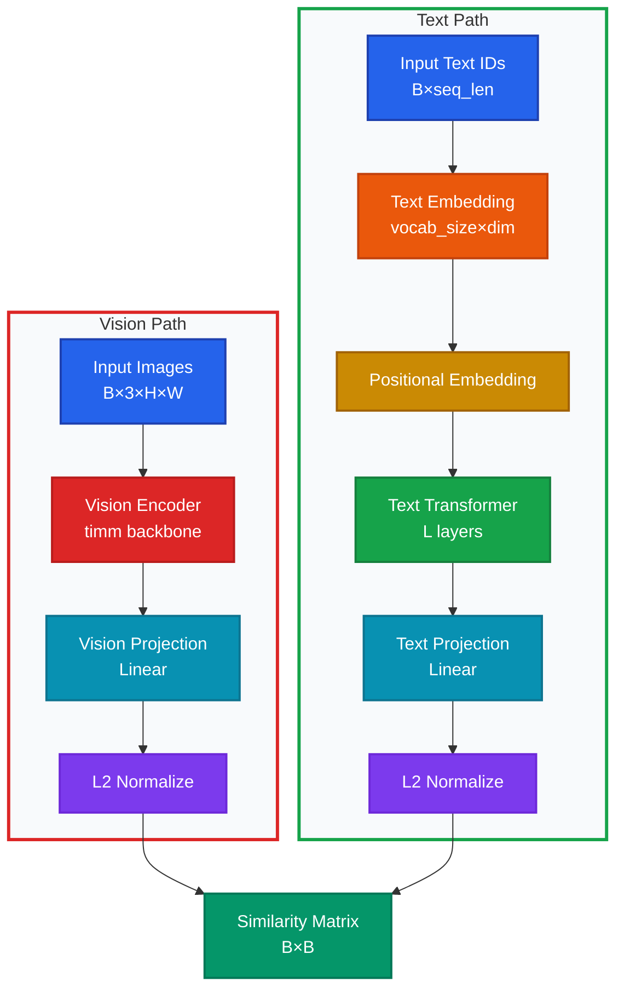
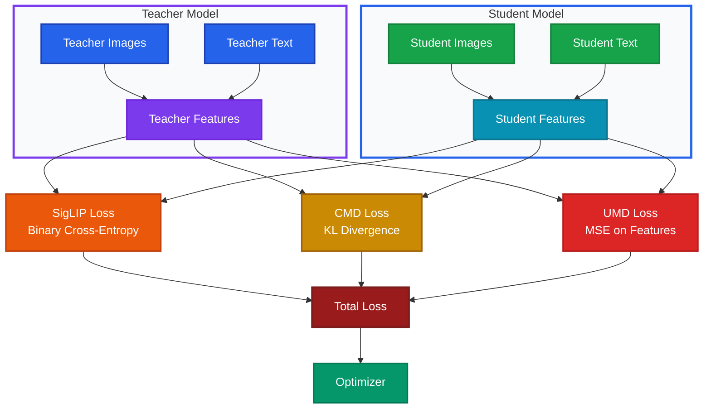

# TinySigLIP

📌 A knowledge distillation framework for creating compact vision-language models, inspired by [TinyCLIP](https://github.com/wkcn/TinyCLIP). TinySigLIP distills knowledge from large SigLIP teacher models to smaller, efficient student models while maintaining competitive performance.

## Highlights

* 🎯 **Efficient Distillation**: Multiple distillation strategies for effective knowledge transfer
* 📉 **Parameter Efficient**: Support for smaller vocabularies, saving **~86M parameters** compared to full models
* ⚡ **Fast Inference**: Compact models with faster inference speed
* 🔄 **Easy to Use**: Simple training and evaluation pipeline
* 📊 **Experiment Tracking**: Real-time training metrics with [Weights & Biases](https://wandb.ai/ReproduceAI/tinysiglip/) integration

## News

* *Coming Soon*: Model Zoo with pre-trained checkpoints
* *In Progress*: Training and evaluation on large-scale datasets

## Model Zoo

Pre-trained models will be released here. Checkpoints are currently under development.

| Model | Teacher | Student Vision | Student Text | ImageNet-1K Zero-shot | Parameters | Status |
|-------|---------|----------------|--------------|----------------------|------------|--------|
| [TinySigLIP-ViT-Tiny] | SigLIP-Base | ViT-Tiny/16 | 19M | [To be filled] | ~39M | 🚧 Training |
| [TinySigLIP-ViT-Small] | SigLIP-Base | ViT-Small/16 | 19M | [To be filled] | ~60M | 📋 Planned |
| [TinySigLIP-ResNet] | SigLIP-Base | ResNet-50 | 19M | [To be filled] | ~45M | 📋 Planned |

> **Note**: Model checkpoints will be available soon. Training progress can be monitored on [W&B Dashboard](https://wandb.ai/ReproduceAI/tinysiglip/).

## Experiment Tracking

Training progress and metrics are tracked using [Weights & Biases](https://wandb.ai). View the experiment dashboard:

🔗 **[View Experiments on W&B](https://wandb.ai/ReproduceAI/tinysiglip/)**

The dashboard includes real-time training metrics, loss curves, model checkpoints, and hyperparameter configurations for all experiments.

## Getting Started

🔰 Here is the setup tutorial, evaluation and training scripts.

### Installation

Install dependencies:

```bash
# Using uv (recommended)
uv sync

# Or using pip
pip install -r requirements.txt
```

### Quick Start

**1. Training**

Start training with default configuration:

```bash
python train.py
```

The training script uses Hydra for configuration management. Modify `config/config.yaml` to adjust hyperparameters.

**Note**: Training metrics are automatically logged to [Weights & Biases](https://wandb.ai/ReproduceAI/tinysiglip/). Make sure you have configured your W&B API key if you want to track experiments:
```bash
wandb login
```

**2. Evaluation**

Evaluate your trained model on ImageNet-1k zero-shot classification:

```bash
python eval_imagenet1k.py \
    --imagenet-val /path/to/imagenet/val \
    --resume /path/to/checkpoint.pt \
    --batch-size 32 \
    --num-workers 4
```

**Arguments:**
- `--imagenet-val`: Path to ImageNet validation set directory
- `--resume`: Path to checkpoint file (`.pt` file saved during training)
- `--batch-size`: Batch size for evaluation (default: 32)
- `--num-workers`: Number of data loading workers (default: 4)
- `--device`: Device to use (default: `cuda`)
- `--logit-scale`: Optional logit scale (temperature). If not specified, uses value from checkpoint.

**Example:**
```bash
# Evaluate a trained model
python eval_imagenet1k.py \
    --imagenet-val ./ImageNet \
    --resume ./outputs/2025-11-29_20-15-10/checkpoint.pt \
    --batch-size 64
```

The evaluation script will:
1. Load the checkpoint and restore model configuration
2. Load or create the processor from checkpoint directory
3. Generate text prompts for all 1000 ImageNet classes (e.g., "a photo of a {class_name}")
4. Compute text features for all classes
5. Evaluate on ImageNet validation set and report Top-1 and Top-5 accuracy

**Note**: The checkpoint directory should contain a `processor/` subdirectory (saved automatically during training) for proper text tokenization. If not available, the script will attempt to create a processor from the checkpoint configuration.

**3. Image-Text Retrieval Evaluation**

Evaluate image-text retrieval performance:

```bash
python eval_retrieval.py \
    --checkpoint /path/to/checkpoint.pt \
    --image-dir /path/to/images \
    --text-file /path/to/captions.txt
```

## Model Architecture


The student model consists of a vision encoder (from `timm`) and a lightweight text encoder:




## Training Approach

The distillation process uses multiple loss components to transfer knowledge from teacher to student:



### Loss Components

1. **SigLIP Loss** (L<sub>SigLIP</sub>): Binary cross-entropy with sigmoid activation for contrastive learning

   ```
   L_SigLIP = (1/2) × [BCE(σ(S_I2T), Y) + BCE(σ(S_T2I), Y)]
   ```

   Where:
   - `σ` is the sigmoid function
   - `S_I2T` and `S_T2I` are similarity matrices (Image-to-Text and Text-to-Image)
   - `Y` is the ground truth label matrix
   - `BCE` is Binary Cross-Entropy

2. **Cross-Modal Distillation (CMD)** (L<sub>CMD</sub>): KL divergence between teacher and student similarity distributions

   ```
   L_CMD = KL(P_T(S_T) || P_S(S_S))
   ```

   Where:
   - `P_T` and `P_S` are probability distributions over teacher and student similarities
   - `S_T` and `S_S` are similarity matrices from teacher and student models

3. **Uni-Modal Distillation (UMD)** (L<sub>UMD</sub>): MSE loss on normalized features from vision and text encoders

   ```
   L_UMD = (1/2) × [MSE(f_V^T, f_V^S) + MSE(f_T^T, f_T^S)]
   ```

   Where:
   - `f_V^T` and `f_V^S` are normalized vision features from teacher and student
   - `f_T^T` and `f_T^S` are normalized text features from teacher and student

4. **Total Loss**:

   ```
   L_total = λ_SigLIP × L_SigLIP + λ_CMD × L_CMD + λ_UMD × L_UMD
   ```

## Project Structure

- `tinysiglip/model.py`: Student model definition (uses `timm` for vision encoder)
- `tinysiglip/loss.py`: Distillation loss functions (SigLIP loss + CMD + UMD + Embedding Mimicking)
- `tinysiglip/embedding_distillation.py`: Token Embedding Layer distillation utilities
- `tinysiglip/coco_dataset.py`: COCO dataset implementation
- `tinysiglip/fake_dataset.py`: Dummy dataset for testing
- `tinysiglip/processor.py`: Data preprocessing utilities
- `tinysiglip/metrics.py`: Evaluation metrics
- `train.py`: Training script with Hydra configuration
- `eval_imagenet1k.py`: ImageNet-1K zero-shot classification evaluation
- `eval_retrieval.py`: Image-text retrieval evaluation

## Configuration

Modify `config/config.yaml` to customize training:

### Key Configuration Options

- **Teacher Model** (`teacher.model_name`):
  - Default: `google/siglip-base-patch16-224`
  - Any SigLIP model from HuggingFace can be used

- **Student Vision Model** (`student.vision_model_name`):
  - Any `timm` model name (e.g., `vit_tiny_patch16_224`, `resnet50`, `efficientnet_b0`)
  - Pre-trained weights will be loaded automatically

- **Student Vocabulary Size** (`student.vocab_size`):
  - Default: `32000` (for English-only models)
  - Can be set smaller than teacher model to save parameters (e.g., 32K vs 256K saves ~86M params)
  - Common sizes: `32000` (English BPE), `50257` (GPT-2), `49152` (English CLIP)
  - Set to `null` to use the same vocabulary size as teacher model

- **Training Hyperparameters**:
  - Batch size, learning rate, warmup steps, etc.
  - Loss weights: `lambda_siglip`, `lambda_cmd`, `lambda_umd`

See `config/config.yaml` for full configuration options.

## Different Vocabulary Sizes

The student model can use a different vocabulary size than the teacher model, which is useful for creating smaller English-specific models.

**Note**: In real applications (with actual text data), you need to:
1. Create/select a tokenizer for the student model (e.g., sentencepiece, BPE)
2. Use different tokenizers to convert the same text to different token IDs
3. Student model uses student tokenizer's token IDs
4. Teacher model uses teacher tokenizer's token IDs

The current code uses dummy data. For demonstration and testing, both models use the same token ID range.

## Token Embedding Layer Distillation / Weight Transfer

When the student model uses a smaller vocabulary than the teacher model (e.g., 32K vs 256K), there are two methods to transfer knowledge:

### Method 1: Weight Transfer (Recommended) ⭐

**Core Advantage**: Zero runtime overhead, one-time initialization

- Before training starts, directly copy weights of shared tokens from teacher model's embedding layer to student model
- No need to compute additional loss terms in the training loop
- Achieves maximum parameter compression

**Implementation**:
- Set `USE_WEIGHT_TRANSFER = True` (default)
- Weights are automatically transferred after model initialization
- Remaining non-shared tokens are randomly initialized and learned during training

**Parameter Savings**: Using a 32K vocabulary compared to 256K can save approximately **86M parameters** (in the embedding layer)

### Method 2: Embedding Mimicking Loss

**Core Idea**:
- Find **shared tokens** in student and teacher vocabularies
- During training, continuously make student model's embeddings for these shared tokens mimic teacher model's embeddings
- Implemented via MSE loss: `L_Emb = MSE(Emb_S(shared tokens), Emb_T(shared tokens))`

**Implementation**:
- Set `USE_WEIGHT_TRANSFER = False`
- Weight controlled by `LAMBDA_EMBEDDING` (default 0.0, as weight transfer is recommended)
- Continuously computed during training

### Using Real Tokenizers

In real applications, you can use actual tokenizers for weight transfer:

```python
from tinysiglip.embedding_distillation import transfer_embedding_weights
from transformers import AutoTokenizer

# Load tokenizers
student_tokenizer = AutoTokenizer.from_pretrained("your-student-tokenizer")
teacher_tokenizer = AutoTokenizer.from_pretrained(TEACHER_MODEL_NAME)

# Execute weight transfer
transfer_embedding_weights(
    student_embedding_layer=student_model.text_embedding,
    teacher_embedding_layer=teacher_model.text_model.embeddings.token_embedding,
    student_tokenizer=student_tokenizer,
    teacher_tokenizer=teacher_tokenizer,
)
```

## Ablation Study

<!-- TODO: Fill in ablation study results -->

### Experimental Setup

- **Teacher Model**: [To be filled]
- **Student Model**: [To be filled]
- **Dataset**: [To be filled]
- **Evaluation Metrics**: [To be filled]

### Results

| Configuration | SigLIP Loss | CMD Loss | UMD Loss | Embedding Transfer | Image-Text Retrieval (R@1) | Text-Image Retrieval (R@1) | Parameters |
|--------------|-------------|----------|----------|-------------------|---------------------------|---------------------------|------------|
| Baseline (SigLIP only) | ✓ | ✗ | ✗ | ✗ | [To be filled] | [To be filled] | [To be filled] |
| + CMD | ✓ | ✓ | ✗ | ✗ | [To be filled] | [To be filled] | [To be filled] |
| + UMD | ✓ | ✓ | ✓ | ✗ | [To be filled] | [To be filled] | [To be filled] |
| + Embedding Transfer | ✓ | ✓ | ✓ | ✓ | [To be filled] | [To be filled] | [To be filled] |

### Analysis

[To be filled: Analysis of ablation study results, including:
- Impact of each loss component
- Effectiveness of embedding weight transfer vs. mimicking loss
- Trade-offs between model size and performance
- Comparison with other distillation methods]

## References

### Core Papers

1. **SigLIP**: Zhai, X., Mustafa, B., Kolesnikov, A., & Beyer, L. (2023). Sigmoid Loss for Language Image Pre-Training. *arXiv preprint arXiv:2303.15343*. [arXiv:2303.15343](https://arxiv.org/abs/2303.15343)

2. **TinyCLIP**: Wu, H., et al. (2023). TinyCLIP: CLIP Distillation via Affinity Mimicking and Weight Inheritance. *Proceedings of the IEEE/CVF International Conference on Computer Vision (ICCV)*. [arXiv:2301.12562](https://arxiv.org/abs/2301.12562)

3. **CLIP**: Radford, A., et al. (2021). Learning Transferable Visual Models From Natural Language Supervision. *International Conference on Machine Learning (ICML)*. [arXiv:2103.00020](https://arxiv.org/abs/2103.00020)

### Knowledge Distillation

4. **Knowledge Distillation**: Hinton, G., Vinyals, O., & Dean, J. (2015). Distilling the Knowledge in a Neural Network. *arXiv preprint arXiv:1503.02531*. [arXiv:1503.02531](https://arxiv.org/abs/1503.02531)

5. **Feature Distillation**: Romero, A., et al. (2014). FitNets: Hints for Thin Deep Nets. *arXiv preprint arXiv:1412.6550*. [arXiv:1412.6550](https://arxiv.org/abs/1412.6550)

### Vision-Language Models

6. **ALIGN**: Jia, C., et al. (2021). Scaling Up Visual and Vision-Language Representation Learning With Noisy Text Supervision. *International Conference on Machine Learning (ICML)*. [arXiv:2102.05918](https://arxiv.org/abs/2102.05918)

7. **BLIP**: Li, J., et al. (2022). BLIP: Bootstrapping Language-Image Pre-training for Unified Vision-Language Understanding and Generation. *International Conference on Machine Learning (ICML)*. [arXiv:2201.12086](https://arxiv.org/abs/2201.12086)

### Model Compression

8. **Model Compression Survey**: Choudhary, T., et al. (2020). A Comprehensive Survey on Model Compression and Acceleration. *Artificial Intelligence Review*, 53(7), 5113-5155. [Link](https://link.springer.com/article/10.1007/s10462-020-09838-1)

## License

See [LICENSE](LICENSE) file for details.

## Citation

If you use this code in your research, please cite:

```bibtex
@misc{tinysiglip2024,
  title={TinySigLIP: SigLIP Model Distillation with Timm-based Student Architecture},
  author={[Your Name]},
  year={2024},
  howpublished={\url{https://github.com/yourusername/TinySigLIP}}
}
```
